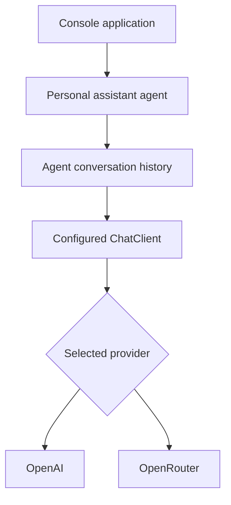

# Part 1: Build a Provider-Configurable Starter Agent in .NET

**Status:** Complete  
**Series:** [Building AI Agents in .NET](../../README.md)

A minimal multi-turn AI agent built with C# and the official OpenAI .NET client. The same application can run with either **OpenAI** or **OpenRouter** through configuration—no C# changes required when switching providers.

> **Course:** Part 1 of _Building AI Agents in .NET_  
> **Next:** Part 2 — Structured Outputs

## Features

- Provider-neutral `ChatClient` creation
- OpenAI and OpenRouter configuration
- API keys stored with .NET user secrets
- Reusable agent definition
- Multi-turn, in-memory conversation history
- `/reset` and `/exit` console commands
- Async model calls with cancellation support
- Basic configuration and request error handling

## Architecture



The application keeps three concerns separate:

| Concern        | Responsibility                                                |
| -------------- | ------------------------------------------------------------- |
| Configuration  | Selects the provider, endpoint, model, and API key            |
| Client factory | Creates one `ChatClient` for the selected provider            |
| Agent          | Combines instructions, model access, and conversation history |

Configuration and the client factory live in a shared `LLMSupport` class library rather than inside `StarterAgent` itself. Every project in the series references `LLMSupport`, so those two concerns are defined exactly once for the whole course.

## Project structure

```text
LLMSupport/
├── Configuration/
│   └── LlmOptions.cs
├── Infrastructure/
│   └── LlmClientFactory.cs
└── LLMSupport.csproj
```

```text
a-starter-agent/
├── Agents/
│   ├── Agent.cs
│   └── PersonalAssistantAgent.cs
├── appsettings.json
├── Program.cs
└── StarterAgent.csproj
```

## Prerequisites

- A .NET SDK supported by the current `OpenAI` package (this series targets `net10.0`)
- An OpenAI or OpenRouter API key
- Basic familiarity with C# and `async`/`await`

## Setup

The commands below assume you are running them from the `agentic-ai-crash-course` solution root, next to `AgenticAiCrashCourse.slnx`.

### 1. Create the shared provider-configuration library

Every article in this series reuses the same provider configuration and `ChatClient` creation logic. Define it once in a shared class library:

```bash
dotnet new classlib --name LLMSupport --output LLMSupport
dotnet sln add LLMSupport/LLMSupport.csproj
dotnet add LLMSupport package OpenAI
```

### 2. Create the starter-agent project

```bash
dotnet new console --name StarterAgent --output a-starter-agent
dotnet sln add a-starter-agent/StarterAgent.csproj
dotnet add a-starter-agent reference LLMSupport
```

### 3. Install the packages

```bash
dotnet add a-starter-agent package OpenAI
dotnet add a-starter-agent package Microsoft.Extensions.Configuration
dotnet add a-starter-agent package Microsoft.Extensions.Configuration.Json
dotnet add a-starter-agent package Microsoft.Extensions.Configuration.EnvironmentVariables
dotnet add a-starter-agent package Microsoft.Extensions.Configuration.UserSecrets
dotnet add a-starter-agent package Microsoft.Extensions.Configuration.Binder
```

Initialize user secrets:

```bash
dotnet user-secrets init --project a-starter-agent
```

### 4. Copy `appsettings.json` to the output directory

Add this inside the `<Project>` element in `StarterAgent.csproj`:

```xml
<ItemGroup>
  <None Update="appsettings.json">
    <CopyToOutputDirectory>Always</CopyToOutputDirectory>
  </None>
</ItemGroup>
```

## Provider configuration

Create `appsettings.json`:

```json
{
  "Llm": {
    "Provider": "OpenAI",
    "Providers": {
      "OpenAI": {
        "Endpoint": "https://api.openai.com/v1",
        "Model": "gpt-5.6"
      },
      "OpenRouter": {
        "Endpoint": "https://openrouter.ai/api/v1",
        "Model": "~openai/gpt-latest"
      }
    }
  }
}
```

Set `Llm:Provider` to either `OpenAI` or `OpenRouter`.

### Store the API key

For OpenAI:

```bash
dotnet user-secrets set \
  "Llm:Providers:OpenAI:ApiKey" \
  "YOUR_OPENAI_KEY" \
  --project a-starter-agent
```

For OpenRouter:

```bash
dotnet user-secrets set \
  "Llm:Providers:OpenRouter:ApiKey" \
  "YOUR_OPENROUTER_KEY" \
  --project a-starter-agent
```

You only need to configure the provider you intend to use. Never commit API keys to `appsettings.json` or source control.

You can also override configuration with environment variables. .NET maps double underscores to nested configuration keys:

```bash
export Llm__Provider="OpenRouter"
export Llm__Providers__OpenRouter__ApiKey="YOUR_OPENROUTER_KEY"
```

## Core implementation

### LLM configuration model

`LlmOptions` lives in the shared `LLMSupport` project so every part of the series can reuse it. Create `LLMSupport/Configuration/LlmOptions.cs`:

```csharp
namespace LLMSupport.Configuration;

public sealed class LlmOptions
{
    public required string Provider { get; init; }

    public required Dictionary<string, LlmProviderOptions> Providers { get; init; }

    public LlmProviderOptions GetSelectedProvider()
    {
        var match = Providers.FirstOrDefault(pair =>
            string.Equals(
                pair.Key,
                Provider,
                StringComparison.OrdinalIgnoreCase));

        return match.Value
            ?? throw new InvalidOperationException(
                $"LLM provider '{Provider}' is not configured.");
    }
}

public sealed class LlmProviderOptions
{
    public required string Endpoint { get; init; }

    public required string Model { get; init; }

    public string? ApiKey { get; init; }
}
```

### Provider-neutral client factory

`LlmClientFactory` also lives in `LLMSupport`. Create `LLMSupport/Infrastructure/LlmClientFactory.cs`:

```csharp
using System.ClientModel;
using OpenAI;
using OpenAI.Chat;
using LLMSupport.Configuration;

namespace LLMSupport.Infrastructure;

public static class LlmClientFactory
{
    public static ChatClient Create(LlmOptions options)
    {
        LlmProviderOptions provider = options.GetSelectedProvider();

        if (string.IsNullOrWhiteSpace(provider.ApiKey))
        {
            throw new InvalidOperationException(
                $"No API key is configured for '{options.Provider}'.");
        }

        if (!Uri.TryCreate(
                provider.Endpoint,
                UriKind.Absolute,
                out Uri? endpoint))
        {
            throw new InvalidOperationException(
                $"The endpoint '{provider.Endpoint}' is invalid.");
        }

        var clientOptions = new OpenAIClientOptions
        {
            Endpoint = endpoint
        };

        var openAiClient = new OpenAIClient(
            new ApiKeyCredential(provider.ApiKey),
            clientOptions);

        return openAiClient.GetChatClient(provider.Model);
    }
}
```

Only this factory knows how provider settings become an SDK client. The rest of the application depends on `ChatClient`.

`StarterAgent` references `LLMSupport` with a project reference (`<ProjectReference Include="..\LLMSupport\LLMSupport.csproj" />`), so it consumes these two types without redefining them.

### Reusable agent

Create `Agents/Agent.cs`:

```csharp
using OpenAI.Chat;

namespace StarterAgent.Agents;

public sealed class Agent
{
    private readonly ChatClient _chatClient;
    private readonly List<ChatMessage> _history;

    public Agent(
        string name,
        string instructions,
        ChatClient chatClient)
    {
        ArgumentException.ThrowIfNullOrWhiteSpace(name);
        ArgumentException.ThrowIfNullOrWhiteSpace(instructions);
        ArgumentNullException.ThrowIfNull(chatClient);

        Name = name;
        Instructions = instructions;
        _chatClient = chatClient;
        _history = [new SystemChatMessage(instructions)];
    }

    public string Name { get; }

    public string Instructions { get; }

    public int MessageCount => _history.Count - 1;

    public async Task<string> RunAsync(
        string input,
        CancellationToken cancellationToken = default)
    {
        ArgumentException.ThrowIfNullOrWhiteSpace(input);

        _history.Add(new UserChatMessage(input));

        try
        {
            ChatCompletion completion =
                await _chatClient.CompleteChatAsync(
                    _history,
                    cancellationToken: cancellationToken);

            string response = string.Concat(
                completion.Content.Select(part => part.Text));

            _history.Add(new AssistantChatMessage(response));

            return response;
        }
        catch
        {
            // Do not retain a user message if its request failed.
            _history.RemoveAt(_history.Count - 1);
            throw;
        }
    }

    public void Reset()
    {
        _history.Clear();
        _history.Add(new SystemChatMessage(Instructions));
    }
}
```

The agent stores conversation history in memory. Every request contains the system instructions followed by all successful user and assistant turns.

### Personal-assistant definition

Create `Agents/PersonalAssistantAgent.cs`:

```csharp
using OpenAI.Chat;

namespace StarterAgent.Agents;

public static class PersonalAssistantAgent
{
    public static Agent Create(ChatClient chatClient)
    {
        return new Agent(
            name: "Personal Assistant",
            instructions:
            """
            You are a helpful personal assistant.

            Follow these guidelines:
            - Give clear and concise answers.
            - Prefer practical recommendations.
            - Ask for clarification when the request is ambiguous.
            - Do not invent facts when you are uncertain.
            """,
            chatClient: chatClient);
    }
}
```

The generic `Agent` owns execution and history, while `PersonalAssistantAgent` supplies the assistant's identity and behavioral instructions.

### Console application

Replace `Program.cs`:

```csharp
using Microsoft.Extensions.Configuration;
using OpenAI.Chat;
using StarterAgent.Agents;
using LLMSupport.Configuration;
using LLMSupport.Infrastructure;

IConfiguration configuration = new ConfigurationBuilder()
    .SetBasePath(AppContext.BaseDirectory)
    .AddJsonFile("appsettings.json", optional: false)
    .AddUserSecrets<Program>(optional: true)
    .AddEnvironmentVariables()
    .Build();

var llmOptions = configuration
    .GetRequiredSection("Llm")
    .Get<LlmOptions>()
    ?? throw new InvalidOperationException(
        "LLM configuration is missing.");

LlmProviderOptions provider = llmOptions.GetSelectedProvider();
ChatClient chatClient = LlmClientFactory.Create(llmOptions);
Agent agent = PersonalAssistantAgent.Create(chatClient);

Console.WriteLine(agent.Name);
Console.WriteLine($"Provider: {llmOptions.Provider}");
Console.WriteLine($"Model:    {provider.Model}");
Console.WriteLine("Commands: /reset, /exit");

while (true)
{
    Console.Write("\nYou: ");
    string? input = Console.ReadLine();

    if (string.IsNullOrWhiteSpace(input))
    {
        continue;
    }

    if (input.Equals("/exit", StringComparison.OrdinalIgnoreCase))
    {
        break;
    }

    if (input.Equals("/reset", StringComparison.OrdinalIgnoreCase))
    {
        agent.Reset();
        Console.WriteLine("Conversation reset.");
        continue;
    }

    try
    {
        string response = await agent.RunAsync(input);

        Console.WriteLine();
        Console.WriteLine($"{agent.Name}: {response}");
    }
    catch (OperationCanceledException)
    {
        Console.WriteLine("The request was cancelled.");
    }
    catch (Exception exception)
    {
        Console.Error.WriteLine(
            $"Agent request failed: {exception.Message}");
    }
}
```

## Run the agent

```bash
dotnet run --project a-starter-agent
```

Try a multi-turn conversation:

```text
You: My name is Sam and I am learning ASP.NET Core.

Personal Assistant: Nice to meet you, Sam! ...

You: What is my name and what am I learning?

Personal Assistant: Your name is Sam, and you are learning ASP.NET Core.
```

The second answer can refer to the first message because the application sends the accumulated conversation history with each request.

### Console commands

| Command  | Effect                                                                   |
| -------- | ------------------------------------------------------------------------ |
| `/reset` | Clears user and assistant history while retaining the agent instructions |
| `/exit`  | Ends the application                                                     |

After `/reset`, the agent should no longer know facts from earlier turns.

## Switch providers

Change only the selected provider:

```json
{
  "Llm": {
    "Provider": "OpenRouter"
  }
}
```

Or override it without editing the file:

```bash
export Llm__Provider="OpenRouter"
dotnet run --project a-starter-agent
```

The agent and console code remain unchanged.

## Current limitations

- Conversation history exists only in memory.
- History disappears when the process exits.
- Every request resends the complete conversation.
- History is not yet bounded or summarized.
- One `Agent` instance represents one conversation and should not be shared concurrently between users.
- The application does not yet stream response tokens.
- Tools, guardrails, persistence, and tracing are introduced later in the series.

## Troubleshooting

### API key is missing

Confirm the secret exists for this project:

```bash
dotnet user-secrets list --project a-starter-agent
```

### `appsettings.json` cannot be found

Confirm the file exists and the project includes:

```xml
<None Update="appsettings.json">
  <CopyToOutputDirectory>Always</CopyToOutputDirectory>
</None>
```

### Provider is not configured

The value of `Llm:Provider` must match a key under `Llm:Providers`, ignoring capitalization.

### Model request fails

Check that:

- the selected provider has its own API key configured;
- the endpoint is correct;
- the configured model is available to your provider account;
- the account has sufficient quota or credits.

## What this project demonstrates

- Provider selection is a configuration concern.
- Credentials belong outside committed configuration.
- An agent combines stable instructions, a model client, and an execution loop.
- Multi-turn memory is accumulated conversation history supplied to the model.
- Provider-neutral application code is possible when both providers expose a compatible API surface.

## Next in the series

Part 2, _Type-Safe Structured Outputs in .NET_, replaces free-form responses with strict JSON Schema and deserializes the result into a C# support-ticket model.

## References

- [OpenAI SDKs and CLI](https://developers.openai.com/api/docs/libraries)
- [OpenAI Chat API reference](https://developers.openai.com/api/reference/resources/chat)
- [OpenRouter quickstart](https://openrouter.ai/docs/quickstart)
